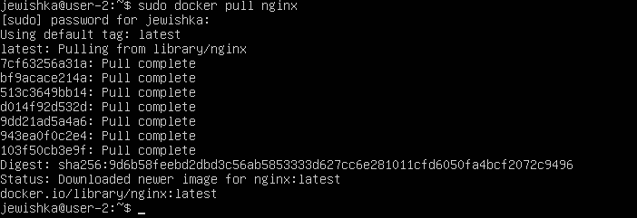
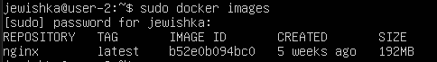
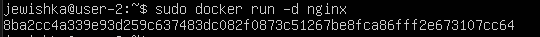
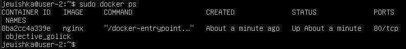
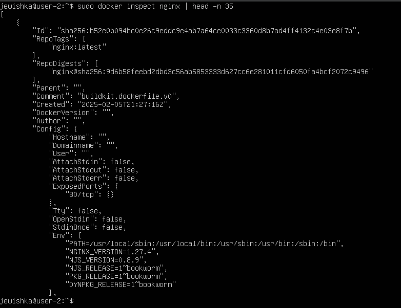
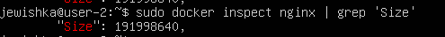
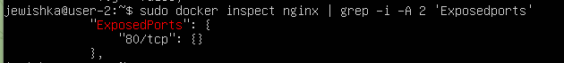

## Part 1. Готовый докер

Возьми официальный докер-образ с nginx и выкачай его при помощи docker pull.

**Результат команды docker pull nginx**

Проверь наличие докер-образа через docker images.

**Результат команды docker images**

Запусти докер-образ через docker run -d [image_id|repository].

**Результат команды docker run -d nginx**

Проверь, что образ запустился через docker ps.

**Результат команды docker ps**

Посмотри информацию о контейнере через docker inspect [container_id|container_name].

**Результат команды docker inspect**

По выводу команды определи и помести в отчёт размер контейнера, список замапленных портов и ip контейнера.

**Размер контейнера**

**Список замапленных портов**

Останови докер контейнер через docker stop [container_id|container_name].

Проверь, что контейнер остановился через docker ps.

Запусти докер с портами 80 и 443 в контейнере, замапленными на такие же порты на локальной машине, через команду run.

Проверь, что в браузере по адресу localhost:80 доступна стартовая страница nginx.

Перезапусти докер контейнер через docker restart [container_id|container_name].

Проверь любым способом, что контейнер запустился.