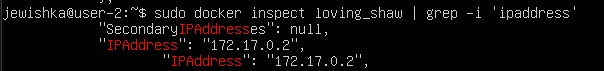

## Part 1. Готовый докер

Возьми официальный докер-образ с nginx и выкачай его при помощи docker pull.

**Изображение 1. Результат команды docker pull nginx**

Проверь наличие докер-образа через docker images.

**Изображение 2.Результат команды docker images**

Запусти докер-образ через docker run -d [image_id|repository].

**Изображение 3. Результат команды docker run -d nginx**

Проверь, что образ запустился через docker ps.

**Изображение 4. Результат команды docker ps**

Посмотри информацию о контейнере через docker inspect [container_id|container_name].

**Изображение 5. Результат команды docker inspect**

По выводу команды определи и помести в отчёт размер контейнера, список замапленных портов и ip контейнера.

**Изображение 6. Размер контейнера**

**Изображение 7. Список замапленных портов**

**Изображение 8. Ip контейнера**

Останови докер контейнер через docker stop [container_id|container_name].

**Изображение 9. Ip контейнера**

Проверь, что контейнер остановился через docker ps.

**Изображение 10. Проверка остановки контейнера**

Запусти докер с портами 80 и 443 в контейнере, замапленными на такие же порты на локальной машине, через команду run.

**Изображение 11. Запуск докера с портами 80 и 443**

Проверь, что в браузере по адресу localhost:80 доступна стартовая страница nginx.

**Изображение 12. Проверка стартовой страницы nginx**

Перезапусти докер контейнер через docker restart [container_id|container_name].

**Изображение 13. Перезапуск докера**

Проверь любым способом, что контейнер запустился.

**Изображение 14. Проверка запуска контейнера**
