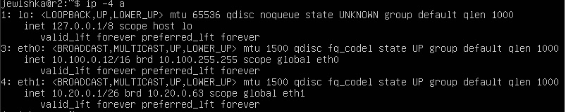
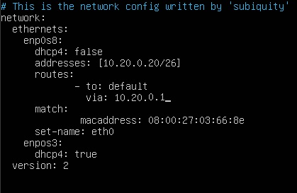
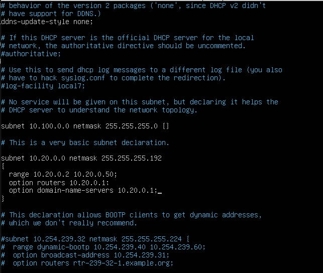

## Part 1. Инструмент ipcalc

1.1. Сети и маски

1. Адрес сети 192.167.38.54/13

**Изображение 1. Адрес сети 192.167.38.54/13**

2. Перевод маски 255.255.255.0 в префиксную и двоичную запись, /15 в обычную и двоичную, 11111111.11111111.11111111.11110000 в обычную и префиксную

**Изображение 2. Префиксная и двоичная запись маски 255.255.255.0**

**Изображение 3. Обычная и двоичная запись /15**

**Изображение 4. Обычная и префиксная запись 11111111.11111111.11111111.11110000**

3. Минимальный и максимальный хост в сети 12.167.38.4 при масках: /8, 11111111.11111111.00000000.00000000, 255.255.254.0 и /4

**Изображение 5. Минимальный и максимальный хост в сети 12.167.38.4 при маске /8**

**Изображение 6. Минимальный и максимальный хост в сети 12.167.38.4 при маске 11111111.11111111.00000000.00000000**

**Изображение 7. Минимальный и максимальный хост в сети 12.167.38.4 при маске 255.255.254.0**

**Изображение 8. Минимальный и максимальный хост в сети 12.167.38.4 при маске /4**

1.2. localhost

IP, с которыми можно обратиться к приложению, работающему на Localhost:
127.0.0.2, 127.1.0.1

C которыми нельзя:
194.34.23.100, 128.0.0.1

Так как localhost находится в диапазоне 127.0.0.1 — 127.255.255.254

1.3. Диапазоны и сегменты сетей

1. Частными ip являются те, которые входят в следующие диапазоны

   10.0.0.0 — 10.255.255.255

   100.64.0.0 — 100.127.255.255

   172.16.0.0 — 172.31.255.255

   192.168.0.0 — 192.168.255.255

В связи с этим:

10.0.0.45 -частный

134.43.0.2-публичный

192.168.4.2-частный

172.20.250.4-частный

172.0.2.1-публичный

192.172.0.1-публичный

172.68.0.2-публичный

172.16.255.255-частный

10.10.10.10-частный

192.169.168.1-публичный

2. Адреса для сети 10.10.0.0/18 должны находиться в диапазоне 10.10.0.1-10.10.63.254

Следовательно:

10.0.0.1-не подходит

10.10.0.2-подходит

10.10.10.10-подходит

10.10.100.1-не подходит

10.10.1.255-подходит

## Part 2. Статическая маршрутизация между двумя машинами

Поднимем две виртуальные машины

**Изображение 9. Виртуальные машины ws1 и ws2**

Просмотрим существующие сетевые интерфейсы

**Изображение 10. Сетевые интерфейсы ws1**

**Изображение 11. Сетевые интерфейсы ws2**

Изменим адреса и маски

**Изображение 11. Файл etc/netplan/00-installer-config.yaml машины ws1**

**Изображение 12. Файл etc/netplan/00-installer-config.yaml машины ws2**

**Изображение 13. Вывод sudo netplan apply ws1**

**Изображение 14. Вывод sudo netplan apply ws2**

2.1. Добавление статического маршрута вручную

**Изображение 15. Статический маршрут между ws1 и ws2**

**Изображение 16. Статический маршрут между ws2 и ws1**

**Изображение 17. Пинг ws2 с ws1**

**Изображение 18. Пинг ws1 с ws2**

2.2. Добавление статического маршрута с сохранением

Добавь статический маршрут от одной машины до другой с помощью файла /etc/netplan/00-installer-config.yaml.

**Изображение 19. Файл etc/netplan/00-installer-config.yaml машины ws1**

**Изображение 20. Файл etc/netplan/00-installer-config.yaml машины ws2**

**Изображение 21. Пинг ws2 с ws1**

**Изображение 22. Пинг ws1 с ws2**

## Part 3. Утилита iperf3

3.1. Скорость соединения

Перевести и записать в отчёт:

8 Mbps = 1 MB/s(мегабит/c в мегабайт/c)

100 MB/s = 819200 Kbps(мегабайт/c в килобит/c)

1 Gbps = 1024 Mbps(гигабит/c в мегабит/c)

3.2. Утилита iperf3

**Изображение 23. Сервер на ws1**

**Изображение 24. Подключение с ws2**

## Part 4. Сетевой экран

4.1. Утилита iptables

Создай файл /etc/firewall.sh, имитирующий файрвол, на ws1 и ws2:

Нужно добавить в файл подряд следующие правила:

1. На ws1 примени стратегию, когда в начале пишется запрещающее правило, а в конце пишется разрешающее правило (это касается пунктов 4 и 5).

2. На ws2 примени стратегию, когда в начале пишется разрешающее правило, а в конце пишется запрещающее правило (это касается пунктов 4 и 5).

3. Открой на машинах доступ для порта 22 (ssh) и порта 80 (http).

4. Запрети echo reply (машина не должна «пинговаться», т. е. должна быть блокировка на OUTPUT).

5. Разреши echo reply (машина должна «пинговаться»).

**Изображение 25. Файл /etc/firewall.sh в ws1**

**Изображение 26. Файл /etc/firewall.sh в ws2**

Запустить файлы на обеих машинах командами chmod +x /etc/firewall.sh и /etc/firewall.sh

**Изображение 27. Запуск /etc/firewall.sh в ws1**

**Изображение 28. Запуск /etc/firewall.sh в ws2**

4.2. Утилита nmap

Пропингуем машины

**Изображение 29. Пинг ws2**

**Изображение 30. Пинг ws1**

Используем nmap

**Изображение 31. nmap машины, которая не пингуется**

## Part 5. Статическая маршрутизация сети

5.1. Настройка адресов машин

**Изображение 32. Файл etc/netplan/00-installer-config.yaml машины ws11**

**Изображение 33. Файл etc/netplan/00-installer-config.yaml машины ws22**

**Изображение 34. Файл etc/netplan/00-installer-config.yaml машины ws21**

**Изображение 35. Файл etc/netplan/00-installer-config.yaml машины r1**

**Изображение 36. Файл etc/netplan/00-installer-config.yaml машины r2**

Проверим что адреса машин заданы верно

**Изображение 37. ip -4 a ws11**

**Изображение 38. ip -4 a ws22**

**Изображение 39. ip -4 a ws21**

**Изображение 40. ip -4 a r1**

**Изображение 41. ip -4 a r2**

Пропингуем машины

**Изображение 42. Пинг ws22 c ws21**

**Изображение 43. Пинг ws11 c r1**

5.2. Включение переадресации IP-адресов

Включим переадресацию на роутерах на непостоянной основе

**Изображение 44. Команда sysctl -w net.ipv4.ip_forward=1 на r1**

**Изображение 45. Команда sysctl -w net.ipv4.ip_forward=1 на r2**

Включим переадресацию на постоянной основе

**Изображение 46. Файл sysctl.conf на r1**

**Изображение 47. Файл sysctl.conf на r2**

5.3. Установка маршрута по умолчанию

Настроим маршрут по умолчанию для ws11, ws22, ws21

**Изображение 48. Файл etc/netplan/00-installer-config.yaml машины ws11**

**Изображение 49. Файл etc/netplan/00-installer-config.yaml машины ws22**

**Изображение 50. Файл etc/netplan/00-installer-config.yaml машины ws21**

Проверим что маршрут добавился в таблицу маршрутизации

**Изображение 51. Команда ip r для ws11**

**Изображение 52. Команда ip r для ws22**

**Изображение 53. Команда ip r для ws21**

Пропингуем r2 с ws11

**Изображение 54. Пинг r2 с ws11**

**Изображение 55. Команда tcpdump -tn -i eth0 на r2**

5.4. Добавление статических маршрутов

Добавим в r1 и r2 статические маршруты

**Изображение 56. Файл etc/netplan/00-installer-config.yaml машины r1**

**Изображение 57. Файл etc/netplan/00-installer-config.yaml машины r2**

Просмотрим таблицы маршрутов

**Изображение 58. Команда ip r на r1**

**Изображение 59. Команда ip r на r2**

**Изображение 60. Команда ip r list 10.10.0.0/18 на ws11**

**Изображение 61. Команда ip r list 0.0.0.0/0 на ws11**

Был выбран более точный маршрут, который указывает конкретный путь для доставки пакета на узел сети назначения.

5.5. Построение списка маршрутизаторов

**Изображение 62. Команда tcpdump -tnv -i eth0 на r1**

**Изображение 63. Traceroute от ws11 до ws21**

Traceroute — это инструмент для отслеживания пути, по которому проходят данные в сети. Он работает с помощью пакетов, у которых постепенно увеличивается поле TTL (Time to Live). Каждый маршрутизатор уменьшает TTL на 1, и когда TTL достигает 0, маршрутизатор отправляет ответ о времени истечения. Таким образом, traceroute отправляет пакеты с увеличивающимся TTL и получает ответы от каждого маршрутизатора на пути, показывая, сколько времени занимает передача данных через каждый узел и какие маршрутизаторы задействованы.

5.6. Использование протокола ICMP при маршрутизации

Запустим перехват трафика и пропингуем несуществующий IP адрес

**Изображение 64. tcpdump -n -i eth0 icmp на r1**

**Изображение 65. ping -c 1 10.30.0.111 на ws11**

## Part 6. Динамическая настройка IP с помощью DHCP

1. Укажи адрес маршрутизатора по умолчанию, DNS-сервер и адрес внутренней сети. Пример файла для r2:

**Изображение 66. Файл /etc/dhcp/dhcpd.conf на r2**

2. В файле resolv.conf пропиши nameserver 8.8.8.8.

**Изображение 67. Файл /etc/resolv.conf на r2**

Перезагрузи службу DHCP командой systemctl restart isc-dhcp-server. Машину ws21 перезагрузи при помощи reboot и через ip a покажи, что она получила адрес. Также пропингуй ws22 с ws21.

**Изображение 68. ip a на ws21**

**Изображение 69. Пинг ws22 с ws21**

Укажем MAC-адрес у ws11

**Изображение 70. Файл etc/netplan/00-installer-config.yaml машины ws11**

Для r1 настрой аналогично r2, но сделай выдачу адресов с жесткой привязкой к MAC-адресу (ws11).

**Изображение 71. Файл /etc/dhcp/dhcpd.conf на r1**

Запросить с ws21 обновление ip адреса

**Изображение 72. Замена ip на ws21**

sudo dhclient -r -удалить ip sudo dhclient -v -добавить ip
